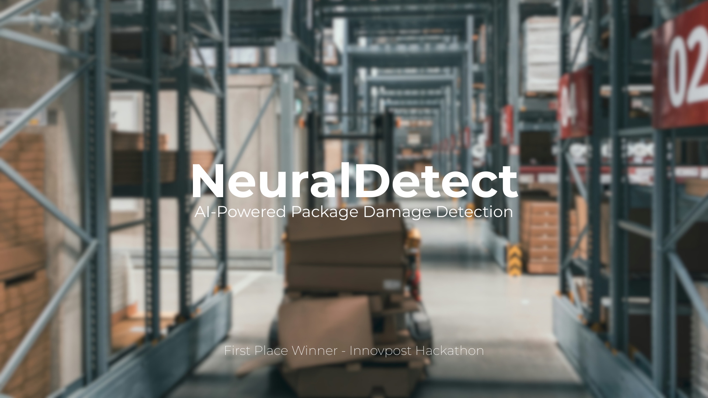

# NeuralDetect: AI-Powered Package Damage Detection



### First Place Winner - Innovpost Hackathon (AI & Computer Vision Track)

This repository contains the full-stack implementation and Jupyter Notebook for **NeuralDetect**, an award-winning project that leverages deep learning to automatically detect damage on postal packages.

---

## Project Overview

In the logistics and postal industries, damaged packages lead to significant financial losses and erode customer trust. Manual inspection is slow, costly, and prone to error. This project, originally developed for the **Innovpost Hackathon by Algérie Poste**, solves this problem by using AI to automate the inspection process.

The project demonstrates an iterative, professional machine learning workflow:
1.  **A Baseline Model:** A ResNet34 was built from scratch to establish initial performance. This model suffered from overfitting and a strong bias towards the 'intact' class (17% recall for damaged packages).
2.  **An Optimized Model:** Using insights from the baseline, a new strategy was implemented using **Transfer Learning (ResNet50V2)**, **Class Weights**, and a **Dynamic Learning Rate Scheduler**. This targeted approach dramatically improved performance, skyrocketing the recall for damaged packages to **78%** and achieving a final test accuracy of **85.7%**.

The web application in this repository serves as a live demonstration of this final, high-performance model.

---

## Key Features

### AI & Backend

*   **Iterative Model Development:** The project showcases a full journey from a baseline model to a highly optimized transfer learning solution.
*   **Advanced Deep Learning Techniques:** Effectively implements Transfer Learning, Class Weights to handle imbalance, and a ReduceLROnPlateau learning rate scheduler for stable training.
*   **ResNet Architecture:** Demonstrates a foundational understanding of modern CNNs by building a ResNet34 from scratch for the baseline.
*   **Flask API:** A lightweight Flask server loads the final `.keras` model and exposes a REST API for real-time predictions.

### Frontend Interface

*   **Modern & Responsive UI:** A polished and professional user interface built with React, Vite, and Tailwind CSS.
*   **Advanced Styling:** Features a custom-designed theme with gradients, glass morphism effects, and a cohesive visual identity.
*   **Dynamic Animations:** Smooth and meaningful animations powered by **Framer Motion** enhance the user experience for loading states, results, and error messages.
*   **Interactive Uploader:** Includes a drag-and-drop file uploader with clear visual feedback for a seamless user interaction.

---

## Tech Stack

**Frontend:**
*   React.js, Vite, Tailwind CSS, Framer Motion

**Backend:**
*   Python, Flask, TensorFlow/Keras, Pillow

---

## Running The Project Locally

To get a local copy up and running, follow these simple steps.

### Prerequisites

*   Node.js (v18 or later)
*   Python (v3.9 or later)
*   npm & pip
*   Git LFS (for handling the large model file)

### Installation & Setup

1.  **Clone the repository:**
    ```sh
    git clone https://github.com/AnouarAdel/NeuralDetect-Package-Damage-Detection.git
    cd NeuralDetect-Package-Damage-Detection
    ```

2.  **Setup the Backend:**
    ```sh
    cd backend
    python -m venv venv
    .\venv\Scripts\Activate
    pip install -r requirements.txt 
    ```
    *(Note: You will need to create a `requirements.txt` file. See the next section.)*

3.  **Setup the Frontend:**
    ```sh
    cd ../frontend 
    npm install
    ```

### Generating `requirements.txt`

Before running the application, you need to generate the `requirements.txt` file for the backend.

1.  Navigate to the `backend` directory.
2.  Ensure your virtual environment is active.
3.  Run the following command:
    ```sh
    pip freeze > requirements.txt
    ```

### Running the Application

1.  **Start the Backend Server:**
    *   Navigate to the `backend` directory and ensure your virtual environment is active.
    *   Run the Flask server:
        ```sh
        python app.py
        ```
    *   The backend will be running on `http://localhost:5000`.

2.  **Start the Frontend Application:**
    *   In a **new terminal window**, navigate to the `frontend` directory.
    *   Run the React development server:
        ```sh
        npm run dev
        ```
    *   Open [http://localhost:5173](http://localhost:5173) to view the application.

---

## Author

**Anouar Adel**
*   **GitHub:** [@AnouarAdel](https://github.com/AnouarAdel)
*   **LinkedIn:** [Anouar Adel](https://www.linkedin.com/in/anouar-adel-0a4928323/)
*   **Email:** [adelanouar60@gmail.com](mailto:adelanouar60@gmail.com)

---

## License

This project is licensed under the MIT License. See the [LICENSE](LICENSE) file for details.